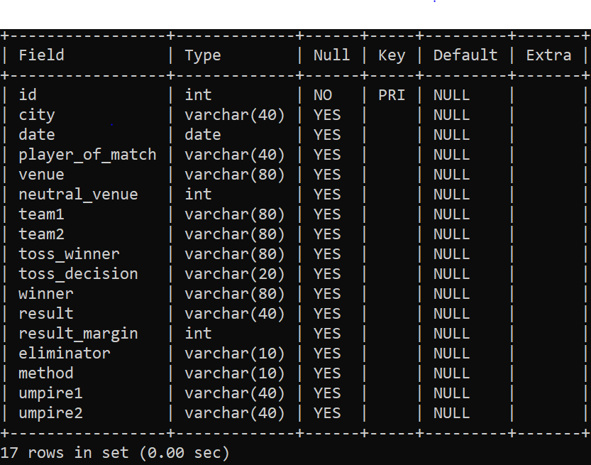
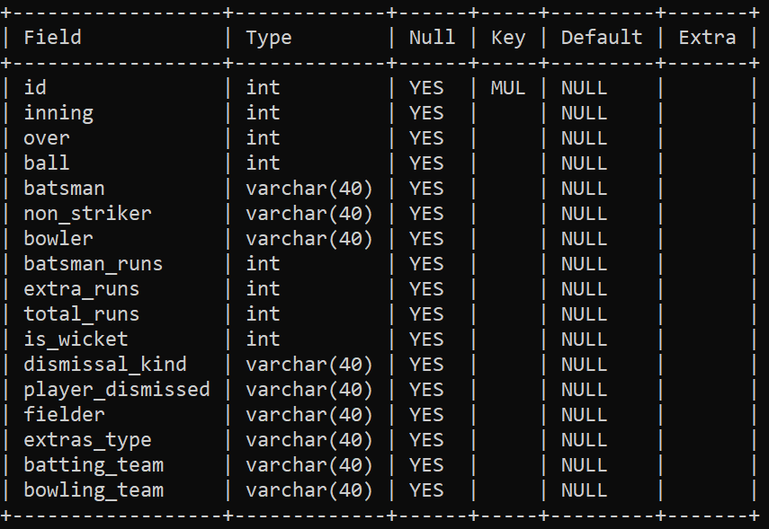
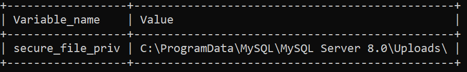
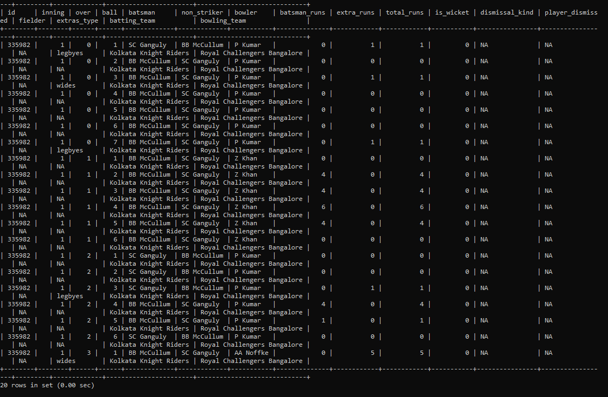
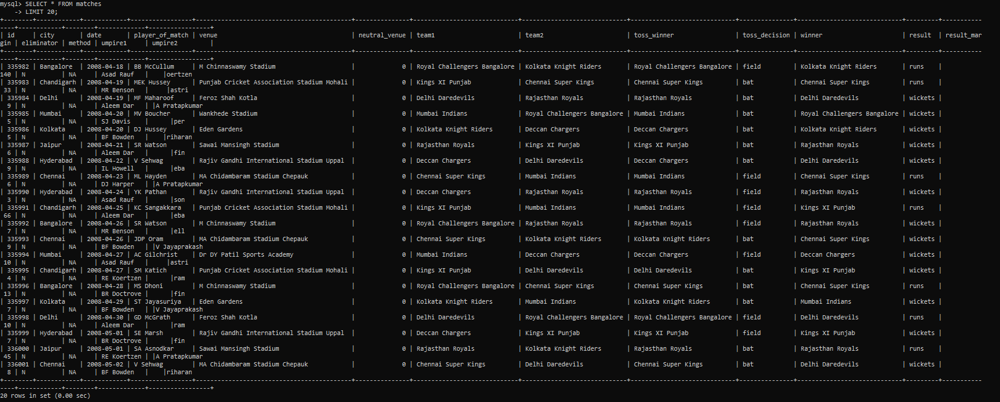
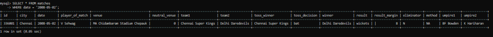
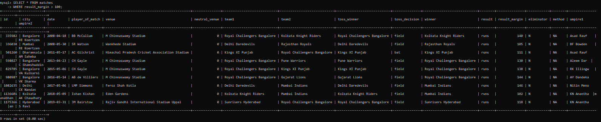

# Problem Statement 2:(Data Analysis)

As a data analysis intern, you have to analyze sports data for a client. You are given two datasets related to IPL (Indian Premier League) cricket matches. One dataset contains ball-by-ball data, and the other contains match-wise data. You have to import the datasets into an SQL database and perform the tasks given in this assignment to find important insights from this dataset.

## Datasets 

[IPL_ball.csv](https://raw.githubusercontent.com/keerti4/sports-data-analysis-using-sql/master/IPL_Ball.csv)

[IPL_matches.csv](https://github.com/keerti4/sports-data-analysis-using-sql/blob/master/IPL_matches.csv)

### Code

[codes_sql.sql](https://github.com/keerti4/sports-data-analysis-using-sql/blob/master/codes_sql.sql)


## About Data

The IPL_ball.csv file is for ball-by-ball data, and it has information on all the 193468 balls bowled between the years 2008 and 2020. It has 17 columns.

The IPL_matches.csv file contains match-wise data and has data of 816 IPL matches. This table has 17 columns.

## Project

1. Create Database ipl.
```sql
CREATE DATABASE ipl;
```

```sql
use ipl;
```

2. Create a table named `matches` with appropriate data types for columns.
```sql
CREATE TABLE matches(
    id INT PRIMARY KEY,
    city VARCHAR(40),
    date DATE,
    player_of_match VARCHAR(40),
    venue VARCHAR(80),
    neutral_venue INT,
    team1 VARCHAR(80),
    team2 VARCHAR(80),
    toss_winner VARCHAR(80),
    toss_decision VARCHAR(20),
    winner VARCHAR(80),
    result VARCHAR(40),
    result_margin INT,
    eliminator VARCHAR(10),
    method VARCHAR(10),
    umpire1 VARCHAR(40),
    umpire2 VARCHAR(40)
);
```

```sql
DESCRIBE matches;
```



3. Create a table named `deliveries` with appropriate data types for columns.
```sql
CREATE TABLE deliveries (
    `id` INT,
    `inning` INT,
    `over` INT,
    `ball` INT,
    `batsman` VARCHAR(40),
    `non_striker` VARCHAR(40),
    `bowler` VARCHAR(40),
    `batsman_runs` INT,
    `extra_runs` INT,
    `total_runs` INT,
    `is_wicket` INT,
    `dismissal_kind` VARCHAR(40),
    `player_dismissed` VARCHAR(40),
    `fielder` VARCHAR(40),
    `extras_type` VARCHAR(40),
    `batting_team` VARCHAR(40),
    `bowling_team` VARCHAR(40),
     FOREIGN KEY(id) REFERENCES matches(id)
);
```

```sql
DESCRIBE deliveries;
```



4. Import data from CSV file ’IPL_matches.csv’ attached in resources to `matches`.
```sql
show variables like "secure_file_priv";
```



```sql
LOAD DATA INFILE "C:\\ProgramData\\MySQL\\MySQL Server 8.0\\Uploads\\IPL_matches.csv" INTO TABLE matches
FIELDS TERMINATED BY ','
LINES TERMINATED BY '\n'
IGNORE 1 LINES
(id,city,date,player_of_match,venue,neutral_venue,team1,team2,toss_winner,toss_decision,winner,result,result_margin,eliminator,method,umpire1,umpire2)
;
```

5.  Import data from CSV file ’IPL_Ball.csv’ attached in resources to `deliveries`.
```sql
LOAD DATA INFILE "C:\\ProgramData\\MySQL\\MySQL Server 8.0\\Uploads\\IPL_Ball.csv" INTO TABLE deliveries
FIELDS TERMINATED BY ','
LINES TERMINATED BY '\r\n'
IGNORE 1 LINES;
```

6. Select the top 20 rows of the `deliveries` table.
```sql
SELECT * FROM deliveries
LIMIT 20;
```



7. Select the top 20 rows of the `matches` table.
```sql
SELECT * FROM matches
LIMIT 20;
```



8.  Fetch data of all the matches played on 2nd May 2013.
```sql
SELECT * FROM matches
WHERE date = '2008-05-02';
```


9.  Fetch data of all the matches where the margin of victory is more than 100 runs.
```sql
SELECT * FROM matches
WHERE result_margin > 100;
```


10.  Fetch data of all the matches where the final scores of both teams are tied and order it in descending order of the date.
```sql
SELECT * FROM matches
WHERE result = 'tie'
ORDER BY date DESC;
```


11. Get the count of cities that have hosted an IPL match.
```sql
SELECT COUNT(DISTINCT city) 
FROM matches;
```


12. Fetch data of all matches played in Rajiv Gandhi international stadium uppal.
```sql
SELECT * FROM matches
WHERE venue = 'Rajiv Gandhi International Stadium Uppal';
```


13. Number of matches won by Chennai super king and Mumbai Indians.
```sql
SELECT COUNT(winner), winner 
FROM MATCHES
WHERE winner = 'Chennai Super Kings' OR winner = 'Mumbai Indians'
GROUP BY winner;
```


14. No. Of matches played on or before 4/20/2014.
```sql
SELECT COUNT(id) FROM matches
WHERE date <= '2014-04-20';
```


